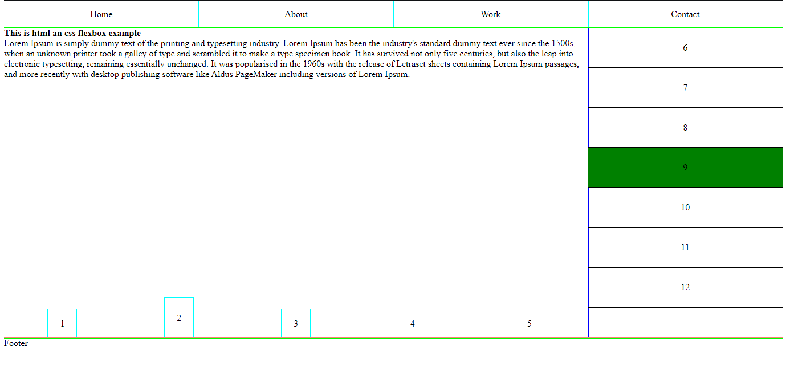
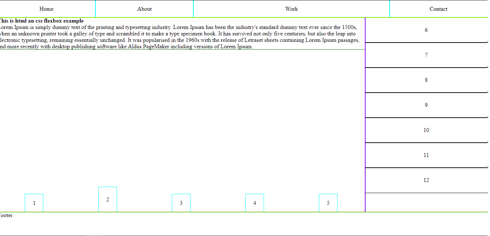
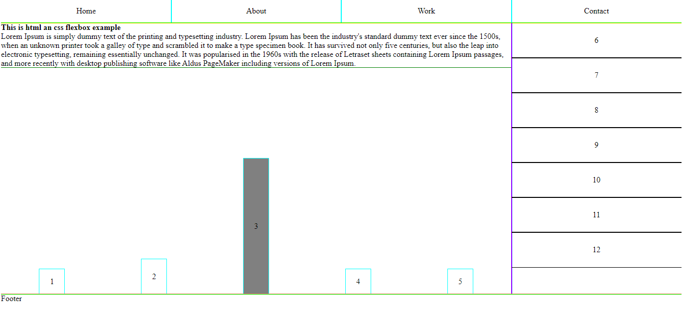

# FlexboxExample
HTML and CSS flexbox example

This is a simple example of how to use a flexbox building whit HTML and CSS:

* Use of hover selector
* Use of display
* Use of flex-direction
* Use of aling
* Use of justify-content
* Use of align-items

And others  CSS tricks

# Flexbox Example View

 
 
 